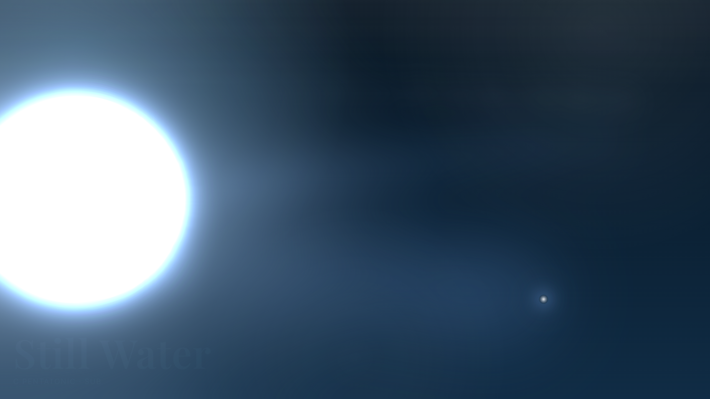
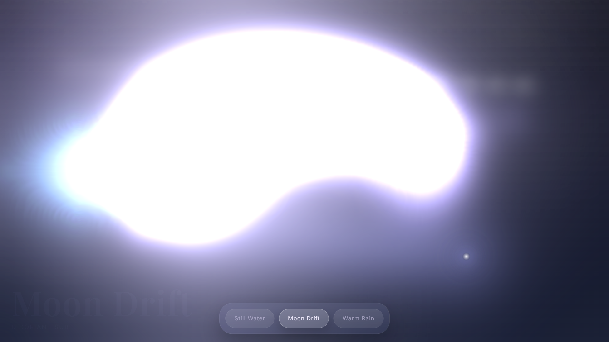
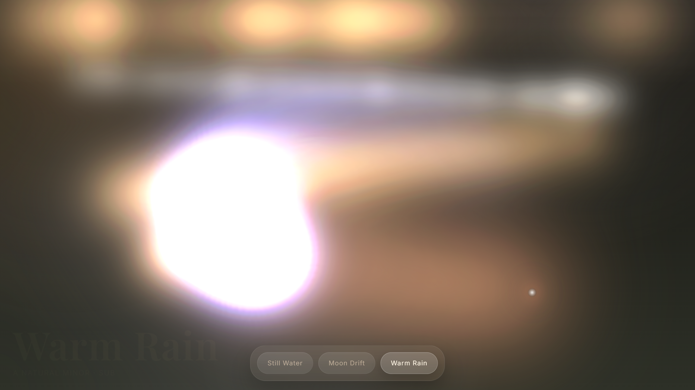

# Luminflow

A browser-based ambient instrument for creating generative soundscapes. Drag to play notes over a real-time WebGL fluid simulation.

**[Try it live](https://branqon.github.io/luminflow)**


## Controls

| Input | Action |
|-------|--------|
| **Left-click + drag** | Play notes — X controls pitch, Y selects instrument zone |
| **Right-click** | Latch a drone chord at that position |
| **Flow mode** | Auto-play that drifts across the canvas |

### Zones (top to bottom)

- **Crystal** — high, shimmering tones
- **Pluck** — warm mid-range notes
- **Sub** — deep, resonant bass

### Moods

Switch between **Still Water**, **Moon Drift**, and **Warm Rain** — each with unique synth voices, effects, and color palettes.

<p align="center">
  
  
  
</p>

## Run locally

```bash
npm install
npm run dev
```

Opens at `http://localhost:8080`.

## Tech stack

- [React](https://react.dev) — UI
- [Tone.js](https://tonejs.github.io) — audio synthesis and effects
- WebGL 2.0 — fluid simulation (adapted from [WebGL-Fluid-Simulation](https://github.com/PavelDoGreat/WebGL-Fluid-Simulation))
- [Vite](https://vite.dev) — build tooling

## License

[MIT](LICENSE)
